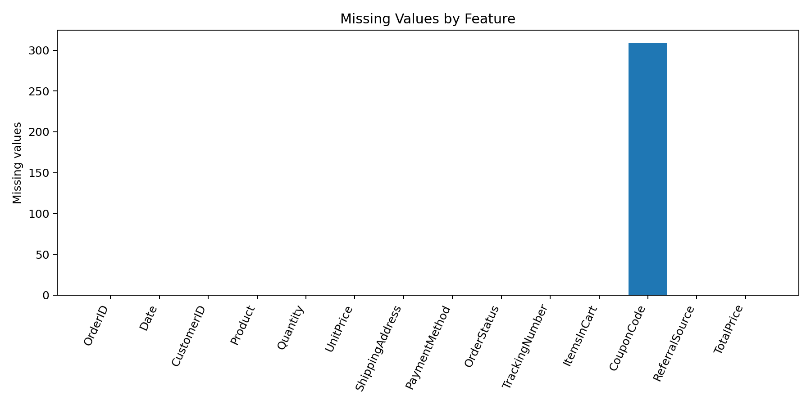
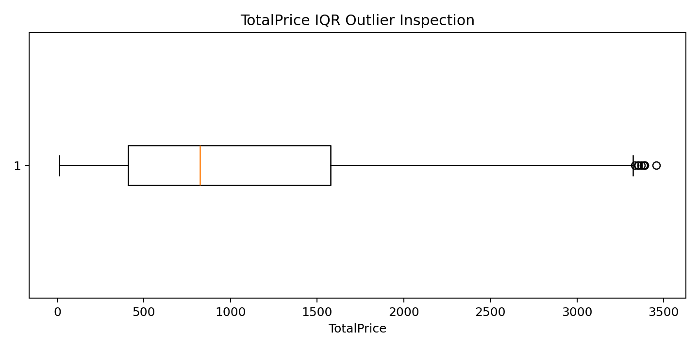
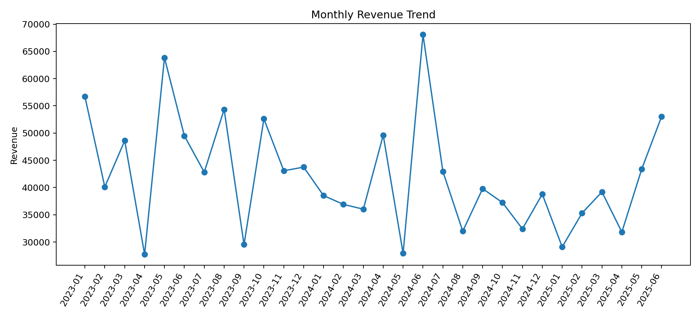
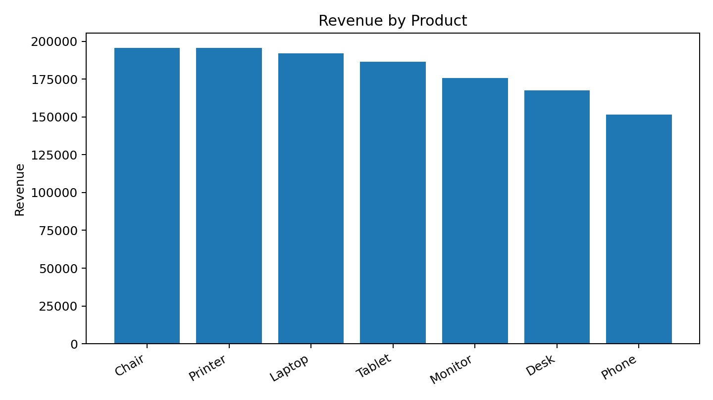

# DecodeLabs Data Science Internship - Project 1
## Advanced EDA & Feature Engineering

A production-minded exploratory data analysis and feature-engineering project built for the **DecodeLabs Industrial Training Program (Batch 2026)**. The objective is to transform raw e-commerce order data into a statistically clean, machine-learning-ready feature set using explicit, reproducible preprocessing rules.

> **Project goal:** transform raw, chaotic data into a mathematically clean dataset ready for machine-learning algorithms.

---

## Project Highlights

- Profiles missingness instead of blindly filling nulls.
- Implements **Mean, Median, and KNN** numeric imputation strategies as reusable pipeline options.
- Treats the dataset's actual missing `CouponCode` values semantically as `NO_COUPON`.
- Detects outliers with the **Interquartile Range (IQR)** method.
- Neutralizes extreme `TotalPrice` values with **winsorization** while preserving every source row.
- Engineers **10+ modeling features**, including temporal, coupon, basket-intensity, and anomaly features.
- Uses **vectorized Pandas/NumPy operations** rather than procedural row loops.
- Provides **one-hot encoding** for nominal categories to avoid false ordinal relationships.
- Includes a numeric **multicollinearity audit** and business-rule validation.
- Includes an optional **Pandera runtime schema contract** and automated tests.

## Dataset Snapshot

| Metric | Result |
|---|---:|
| Raw rows | 1,200 |
| Raw columns | 14 |
| Date range | 2023-01-01 to 2025-06-30 |
| Duplicate `OrderID` values | 0 |
| Missing `CouponCode` values | 309 (25.75%) |
| Numeric missing values | 0 |
| IQR outliers in `TotalPrice` | 8 |
| Total revenue | 1,264,761.96 |
| Average order value | 1,053.97 |
| Coupon usage | 74.25% |
| Highest-revenue product | Chair (195,620.11) |

The only raw feature with missing values is `CouponCode`. Because an absent coupon naturally represents **no coupon used**, the production pipeline keeps the original column for traceability and creates `CouponCode_Imputed = "NO_COUPON"`. The reusable numeric imputation module still supports mean, median, and KNN so the pipeline remains valid when future numeric missingness appears.

## EDA Evidence

### Missingness


### TotalPrice outlier inspection


### Monthly revenue


### Product revenue


## Feature Engineering

The processed dataset contains the original variables plus engineered modeling features:

| Feature | Purpose |
|---|---|
| `CouponCode_Imputed` | Replaces missing coupon values with the explicit `NO_COUPON` category |
| `HasCoupon` | Binary coupon-use signal |
| `OrderYear` | Year extracted from order date |
| `OrderMonth` | Month extracted from order date |
| `OrderQuarter` | Quarter extracted from order date |
| `OrderDayOfWeek` | Weekday behavior signal |
| `IsWeekend` | Weekend indicator |
| `BasketFillRatio` | `Quantity / ItemsInCart` |
| `OrderValuePerCartItem` | `TotalPrice / ItemsInCart` |
| `TotalPrice_IQR_Outlier` | Anomaly indicator using IQR boundaries |
| `TotalPrice_Winsorized` | Outlier-neutralized value for robust modeling |

A complete feature dictionary is available at `data/processed/feature_dictionary.csv`.

## Outlier Strategy

For `TotalPrice`, the project calculates:

```text
IQR = Q3 - Q1
Lower Bound = Q1 - 1.5 * IQR
Upper Bound = Q3 + 1.5 * IQR
```

Observed bounds are **-1,341.41 to 3,330.41**, with **8 observations** above the upper boundary. The original `TotalPrice` is retained because it remains consistent with `Quantity * UnitPrice`; a separate `TotalPrice_Winsorized` modeling feature is clipped to the statistical boundary. This preserves row count, auditability, and source truth.

## Input -> Process -> Output Architecture

```text
INPUT
  Raw Excel orders
  -> missingness profile
  -> uniqueness/range/business-rule checks

PROCESS
  -> semantic + statistical imputation utilities
  -> IQR outlier detection and winsorization
  -> vectorized feature engineering
  -> one-hot encoding for nominal variables
  -> correlation / multicollinearity audit

OUTPUT
  -> cleaned_orders_features.csv
  -> cleaned_orders_features.xlsx
  -> feature dictionary
  -> EDA figures and report
  -> optional Pandera contract + tests
```

## Repository Structure

```text
DecodeLabs_Project_1_Advanced_EDA_Feature_Engineering/
├── data/
│   ├── raw/
│   │   └── Dataset_for_Data_Analytics.xlsx
│   └── processed/
│       ├── cleaned_orders_features.csv
│       ├── cleaned_orders_features.xlsx
│       └── feature_dictionary.csv
├── notebooks/
│   └── 01_advanced_eda_feature_engineering.ipynb
├── reports/
│   ├── figures/
│   ├── EDA_REPORT.md
│   └── metrics.json
├── src/
│   ├── data_pipeline.py
│   └── schema_contract.py
├── tests/
│   └── test_pipeline.py
├── references/
│   └── DecodeLabs_Project_1_Brief.pdf
├── run_pipeline.py
├── requirements.txt
├── LICENSE
├── .gitignore
└── README.md
```

## How to Run

```bash
python -m venv .venv
```

Activate the environment, then install dependencies:

```bash
pip install -r requirements.txt
```

Run the complete pipeline:

```bash
python run_pipeline.py
```

Run tests:

```bash
python -m pytest -q
```

Open the notebook for a step-by-step analytical walkthrough:

```bash
jupyter notebook notebooks/01_advanced_eda_feature_engineering.ipynb
```

## Statistical & Engineering Decisions

**Missing data:** the pipeline first measures missingness percentage. It supports mean/median/KNN for numeric columns, while the real `CouponCode` nulls are treated as a meaningful categorical state rather than inventing a coupon value.

**Outliers:** observations are flagged using IQR. Instead of deleting valid high-value orders, the project creates a winsorized modeling feature so downstream estimators can be protected without destroying source observations.

**Categorical encoding:** nominal categories are one-hot encoded rather than label-encoded, avoiding artificial mathematical distance between categories.

**Multicollinearity:** the pipeline audits absolute Pearson correlations above 0.80. Highly dependent engineered variables should be reviewed against the modeling target before one is removed.

**Structural contracts:** business assertions verify unique identifiers, positive monetary fields, expected quantity ranges, and the invariant `TotalPrice ≈ Quantity * UnitPrice`. An optional Pandera schema demonstrates how these checks can be enforced at runtime in a production pipeline.

**Training-serving consistency:** this repository is a batch preprocessing project, not an online prediction service. A production feature store such as Feast would become relevant only when the same features must be served consistently to both training jobs and real-time inference. The notebook documents that extension without pretending this static internship dataset requires deployed infrastructure.

## Skills Demonstrated

`Python` · `Pandas` · `NumPy` · `Scikit-learn` · `EDA` · `Statistical Imputation` · `IQR` · `Winsorization` · `Feature Engineering` · `One-Hot Encoding` · `Correlation Analysis` · `Data Validation` · `Pandera` · `Pytest`

## Author

**Muhammad Usaid**  
Data Science Intern - DecodeLabs  
Data Analyst / Aspiring Data Scientist

## License

This project is released under the [MIT License](LICENSE).
